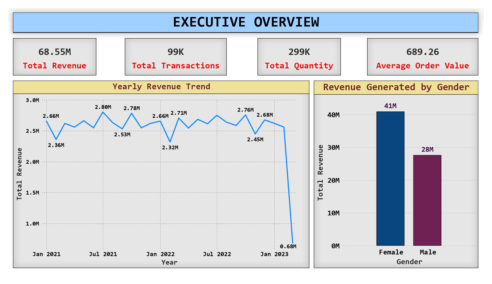
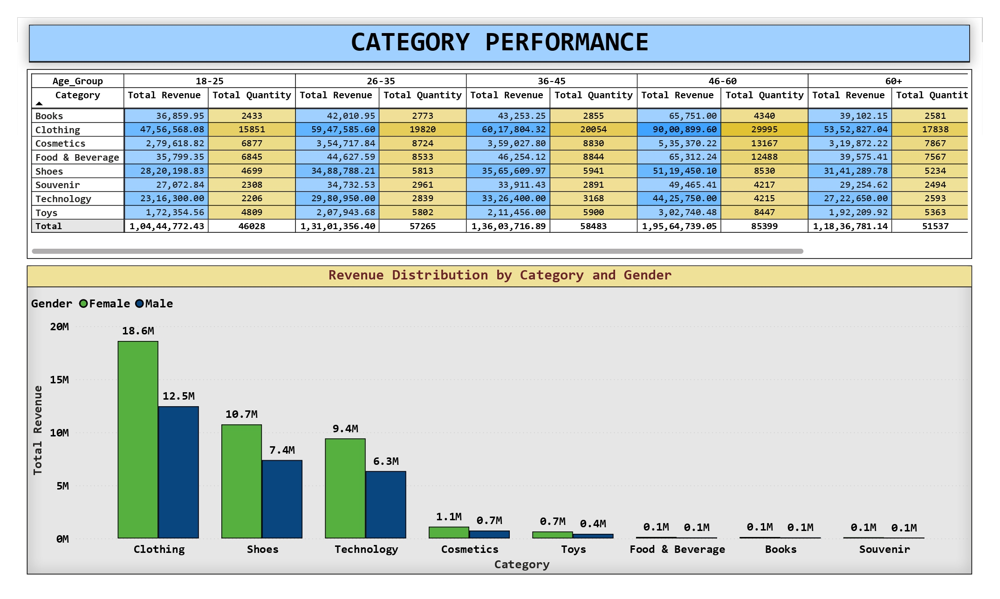
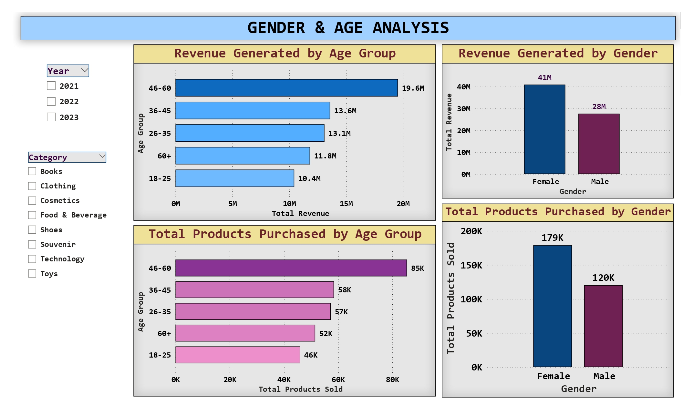
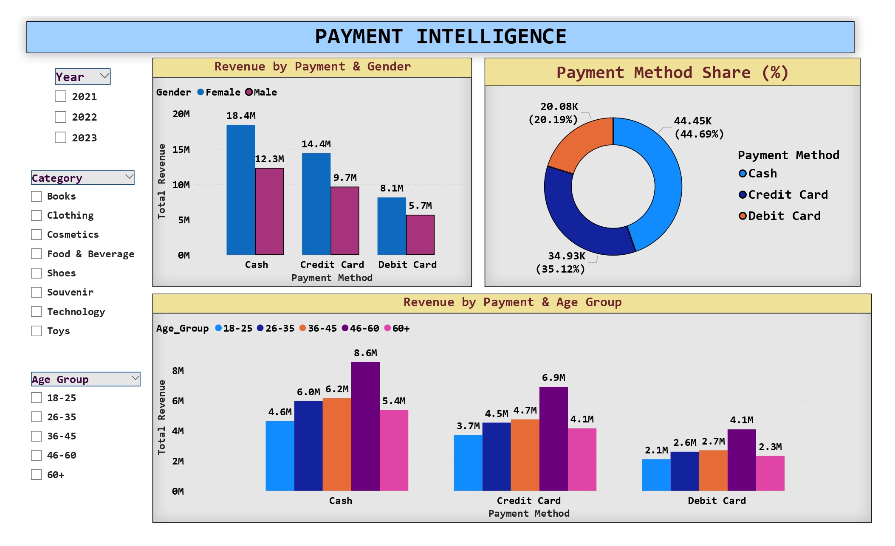

# 🛒 Retail Customer Behavior & Revenue Analytics

> **End-to-End Retail Data Analytics using MySQL & Power BI | Demographic Segmentation and Revenue Driver Analysis**

## 📑 Table of Contents
- [Executive Summary](#-executive-summary)
- [Business Problem & Objectives](#-business-problem--objectives)
- [Methodology & Data Engineering](#-methodology--data-engineering)
- [Repository Structure](#-repository-structure)
- [Data Dictionary](#-data-dictionary)
- [Executive Dashboards](#-executive-dashboards)
- [Key Business Insights](#-key-business-insights)
- [Strategic Recommendations](#-strategic-recommendations)
- [How to Use This Repository](#-how-to-use-this-repository)

---

## 🚀 Executive Summary
This project represents an end-to-end business intelligence pipeline analyzing retail transactions from major Istanbul shopping malls between 2021 and 2023. By evaluating over **99,000 transactions** generating **$68.55M in gross revenue**, the objective was to decode consumer purchasing patterns, pinpoint demographic preferences, and identify core revenue drivers. 

Through strict SQL-based data validation, ETL transformations, and interactive Power BI dashboarding, this analysis translates raw transactional data into actionable corporate strategies for inventory management, targeted marketing, and payment processing optimization.

---

## 🎯 Business Problem & Objectives
The business required deep visibility into transactional data to transition from reactive reporting to proactive, data-driven decision-making. 

**Core Analytical Objectives:**
1. **Demographic Profiling:** Identify which age and gender segments contribute the highest volume and overall revenue.
2. **Category Performance:** Determine the anchor product categories driving store traffic and sales.
3. **Payment Intelligence:** Analyze payment method preferences to inform point-of-sale (POS) processing strategies.
4. **Actionable ROI:** Provide concrete, data-backed recommendations to increase Average Order Value (AOV) and conversion rates.

---

## ⚙️ Methodology & Data Engineering
A rigorous ETL (Extract, Transform, Load) and validation process was engineered using **MySQL** (restricted to `SELECT`-only enterprise environments) and **Power Query**.

- **Data Quality Auditing:** Conducted exhaustive programmatic checks for null values, exact duplicates, and invalid numeric entries across 99,457 records.
- **Metric Correction (Critical Fix):** Identified an anomaly where the raw `price` column actually represented *Total Transaction Revenue* rather than unit price. This was logically verified and redefined as `revenue` to prevent catastrophic double-counting.
- **Feature Engineering:** Transformed raw `age` data into structured categorical bins (`18-25`, `26-35`, `36-45`, `46-60`, `60+`) to enable scalable, macro-level demographic segmentation.
- **Temporal Extraction:** Engineered Year and Month dimensions directly from the raw timestamps to facilitate accurate time-series and trend analysis.

---

## 📂 Repository Structure

    retail-customer-analytics/
    │
    ├── data/
    │   ├── raw_transactions_data.csv
    │   └── transformed_transactions_data.csv
    │
    ├── sql_scripts/
    │   └── retail_transaction_analysis.sql
    │
    ├── dashboards/
    │   ├── retail_revenue_dashboard.pbix
    │   └── Dashboard_Visualizations_Export.pdf
    │
    ├── documents/
    │   ├── Comprehensive_Analysis_Report.docx
    │   └── Executive_Summary_Presentation.pdf
    │
    ├── assets/                                 
    │   ├── dashboard_executive_overview.jpg
    │   ├── dashboard_category_performance.jpg
    │   ├── dashboard_demographic_analysis.jpg
    │   ├── dashboard_payment_intelligence.jpg
    │   └── ... (and 11 other supporting visualization assets)
    │
    └── README.md

---

## 📖 Data Dictionary

| Column Name | Data Type | Description |
| :--- | :--- | :--- |
| `invoice_no` | String | Unique alphanumeric identifier for each transaction |
| `customer_id` | String | Unique identifier for each individual customer |
| `gender` | String | Gender of the customer (Male/Female) |
| `age` | Integer | Raw age of the customer (subsequently binned in ETL) |
| `category` | String | Product category (e.g., Clothing, Shoes, Technology) |
| `quantity` | Integer | Total number of units purchased per invoice |
| `revenue` | Float | Total transaction value (Derived from original 'price' anomaly) |
| `payment_method` | String | Mode of payment (Cash, Credit Card, Debit Card) |
| `invoice_date` | Date | Timestamp of transaction execution |
| `shopping_mall` | String | Geographic location/branch where the purchase occurred |

---

## 📊 Executive Dashboards

### 1. Executive Overview
Provides a high-level snapshot of total retail health, including $68.55M in total revenue, yearly stability trends, and macro-gender contributions.
 

### 2. Category Performance
Analyzes the overwhelming market dominance of the *Clothing*, *Shoes*, and *Technology* categories across all demographics.
 

### 3. Demographic Analysis (Gender & Age)
Highlights the 46-60 age group and Female demographics as the primary, undisputable revenue engines for the business.
 

### 4. Payment Intelligence
Showcases the persistent dominance of physical Cash payments while tracking the strong, high-ticket secondary performance of Credit Cards.
 

---

## 💡 Key Business Insights

1. **Demographic Revenue Drivers:** - **Female customers** represent the primary revenue engine, accounting for ~60% of total transactions and driving **$41M** in overall revenue.
   - The **46–60 age bracket** is the absolute most lucrative consumer segment, generating the highest transaction volume (~28K) and returning the highest gross revenue (**$19.6M**).
2. **Product Category Performance:**
   - **Clothing** is the undisputed anchor category (**$31.1M**), followed securely by **Shoes** ($18.1M) and **Technology** ($15.8M).
   - Female customers consistently outperform males across all major categories, specifically dominating these high-margin product lines.
3. **Payment Behavior:**
   - **Cash** remains the dominant form of transaction settlement globally (**44.69%** of all purchases).
   - Credit Cards account for **35.12%** of transactions but drive highly competitive secondary revenue ($24.1M), indicating consumer preference for using credit on bulk or high-ticket items.
4. **Time Trends:**
   - Revenue generation remained remarkably stable across 2021-2023 with no erratic seasonal volatility, ensuring highly predictable supply-chain forecasting capability.

---

## ♟️ Strategic Recommendations

- **Targeted Marketing Allocation:** Shift digital advertising and promotional ad-spend to heavily target the 46–60 and Female demographics to maximize ROI and immediately boost conversion rates.
- **Inventory Optimization:** Guarantee maximum stock availability and premium floor space allocation for *Clothing, Shoes, and Technology* across all shopping malls. Systematically phase out or reduce overstock in low-performing categories (e.g., Books and Souvenirs).
- **Payment Digitization Strategy:** Since Credit Card transactions securely drive higher order values, implement POS loyalty programs, point multipliers, or targeted financing options to actively incentivize the transition away from physical cash handling.
- **Cross-Selling & Bundling:** Implement physical and digital product bundling for highly associated categories (e.g., Clothing + Shoes) to natively increase the Average Order Value (AOV) without increasing Customer Acquisition Costs (CAC).

---

## 🛠️ How to Use This Repository

1. **Review the Data Validation:** Open `sql_scripts/retail_transaction_analysis.sql` to view the comprehensive data auditing and ETL processes utilized prior to visualization.
2. **Explore the Dashboard:** Download `dashboards/retail_revenue_dashboard.pbix` and open it in Power BI Desktop to interact with the slicers, dynamic tooltips, and cross-filtering capabilities.
3. **Read the Executive Report:** For a deep dive into the business context, review the `Comprehensive_Analysis_Report.docx` located in the `documents/` folder.

---
*Prepared by Karthik Yelugam | Data Analyst*
